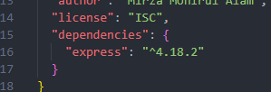
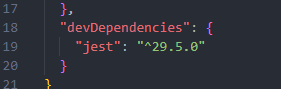

###### Learn npm

<div align="center">
    
    <h1>Welcome to Learn NPM</h1>
</div>

<details open>
    <summary><h2>Table of Contains</h2></summary>
    <ol>
        <li>
            <a href="#about-npm">About npm</a>
            <ul>
                <li><a href="#several-most-common-npm-packages">Several Most Common npm Packages</a></li>
            </ul>
        </li>
        <li>
            <a href="#getting-started">Getting Started</a>
            <ul>
                <li><a href="#basic-npm-commands">Basic npm Commands</a></li>
                <ul>
                    <li><a href="#step-1-command-warm-ups">Step-1: Command Warm-Ups</a></li>
                    <li><a href="#step-2-making-packagejson-file">Step-2: Making package.json File</a></li>
                    <li><a href="#step-3-npm-install-process">Step-3: npm Install Process</a></li>
                    <li><a href="#step-4-npm-update-and-uninstall">Step-4: npm Update and Uninstall</a></li>
                </ul>
                <li><a href="#packagejson-script-field">Package.json Script Field</a></li>
                <li><a href="#what-about-npx">What About npx</a></li>
            </ul>
        </li>
            <li><a href="#conclusion">Conclusion</a></li>
            <li><a href="#author">Author</a></li>
            <li><a href="#contributions">Contributions</a></li>
        </li>
    </ol>

</details>

# About npm

npm (short for Node Package Manager) is a package manager for the JavaScript programming language. With npm, developers can easily install and manage hundreds of thousands of packages from the npm registry, which is a public repository of open-source JavaScript packages. npm supports CLI (Command Line Interfacce) through which developers can perform various tasks such as installing packages, updating packages, removing packages, searching for packages, publishing packages, and managing dependencies.

Overall, npm is an essential tool for modern JavaScript development, making it easy to manage dependencies, speed up development, and improve the quality of code.

<div align="right">
    <b><a href="#learn-npm">↥ back to top</a></b>
</div>

## Several Most Common npm Packages

`react:` A popular JavaScript library for building user interfaces.
`react-router:` Declarative routing for React.
`nodemon:` Automatically restart node application when file changes are detected.
`express:` Fast, unopinionated, minimalist web framework for Node.js.
`typescript:` TypeScript is a language for application scale JavaScript development.
`mongoose:` A library for working with MongoDB databases in Node.js.
`axios:` Promise based HTTP client for the browser and node.js

<div align="right">
    <b><a href="#learn-npm">↥ back to top</a></b>
</div>

# Getting Started

All the basic stuffs will be covered regarding npm and package.json file. All you need to do just install node in your system, and you are ready to go.

## Basic npm Commands

In here, I discussed regarding npm help documentations shown in the terminal. If you get ever stuck in the middle of a work, it is really annoying. Help documentation might come to rescue.

##### Syntax

```cmd
npm <command>
```

##### Most common \<command\> name:

|      Command      |     Alias     |                 Description                  |
| :---------------: | :-----------: | :------------------------------------------: |
|       init        |               |          Create a package.json file          |
|      install      |       i       | install all the dependencies in your project |
|  install \<foo>   |   i \<foo>    |  add the \<foo> dependency to your project   |
|      update       |               |               Update packages                |
|     uninstall     |               |               Remove a package               |
| \<command> --help | \<command> -h |           quick help on \<command>           |
|   help \<term>    |               |  search for help on \<term> (in a browser)   |
|      --help       |      -h       |          display help documentation          |
|     --version     |      -v       |                 show version                 |

<div align="right">
    <b><a href="#learn-npm">↥ back to top</a></b>
</div>

#### Step-1: Command Warm-Ups:

<details>
    <summary>1. How can you check your npm version?</summary>

```cmd
npm -v
```

or,

```cmd
npm --version
```

</details>

<details>
    <summary>2. Print npm help documentation.</summary>

```cmd
npm -h
```

or,

```cmd
npm --help
```

</details>

<details>
    <summary>3. Let you want to install something. But you need some documentation help. How can you get it?</summary>

```cmd
npm i -h
```

or,

```cmd
npm install --help
```

</details>

<details>
    <summary>4. Okay, let's say, you need more details help documentation. What about in a browser based help documentation!! How can you get it?</summary>

```cmd
npm help install
```

</details>

<div align="right">
    <b><a href="#learn-npm">↥ back to top</a></b>
</div>

#### Step-2: Making package.json File:

<details>
    <summary>5. How can you create a package.json file by npm?</summary>

```cmd
npm init
```

or, to skip questions,

```cmd
npm init -y
```

This creates a package.json file in working directory. Open it and surf. It probably appears like this.


</details>

<div align="right">
    <b><a href="#learn-npm">↥ back to top</a></b>
</div>

#### Step-3: npm Install Process:

|    Flag    |              Meaning              |
| :--------: | :-------------------------------: |
|     -g     |         install globally          |
| --save-dev |    install as a dev-dependency    |
|   --save   | (default) install as a dependency |

<details>
    <summary>6. Suppose, you want to add `express` in your package.json under `dependencies`. How can you do that?</summary>

```cmd
npm i express
```

> **Note:** > `4.18.2 means:` major version . minor version . patch version

| Version |                                                    Meaning                                                    |
| :-----: | :-----------------------------------------------------------------------------------------------------------: |
| 4.18.2  |                      dependency is not allowed to update to any version except this one.                      |
| ^4.18.2 | dependency is allowed to update to any minor or patch version, as long as the major version remains the same. |
| ~4.18.2 |         dependency is allowed to update to any patch version, but not to any minor or major version.          |
|   \*    |                                dependency is allowed to update to any version.                                |
| latest  |                                      dependency must be latest version.                                       |



</details>

<details>
    <summary>7. If you want to install <code>jest</code> as a dev dependency, what should you need to do?</summary>

```cmd
npm i jest --save-dev
```



</details>

<details>
    <summary>8. Is it possible to install multiple package at the same time?</summary>
    
```cmd
npm install <package-1> <package-2> <package-3> .........
```

</details>

<details>
    <summary>9. How can we install `nodemon` globally?</summary>

```cmd
npm i nodemon -g
```

</details>

<details>
    <summary>10. What is the meaning of <code>npm install</code>?</summary>

It installs all the dependencies and dev-dependencies in package.json

</details>

<div align="right">
    <b><a href="#learn-npm">↥ back to top</a></b>
</div>

#### Step-4: npm Update and Uninstall:

##### Syntax:

To update a package: `npm update <package>` </br>
To uninstall a package: `npm uninstall <package>`

<div align="right">
    <b><a href="#learn-npm">↥ back to top</a></b>
</div>

## Package.json Script Field

```json
  "scripts": {
    "start": "node index.js",
    "dev": "nodemon dev.js"
  },
```

To access this, type `npm start` or `npm run dev` in the terminal.

[Official Docs About Scripts](https://docs.npmjs.com/cli/v9/using-npm/scripts)

<div align="right">
    <b><a href="#learn-npm">↥ back to top</a></b>
</div>

## What About npx

npx stands for Node Package eXecute. From version 5.2+, npx is used to execute node packages without the need to install them. With npx, you can run a package by simply specifying its name and version, and npx will download and execute it for you. This is particularly useful when you need to run a one-time command or script, or when you want to try out a package without installing it permanently.

##### Example:

```cmd
npx create-react-app my-app
```

<div align="right">
    <b><a href="#learn-npm">↥ back to top</a></b>
</div>

# Conclusion

At this point, a basic understanding and working process should be achieved. Use this artical as a **cheat sheet.**

<div align="right">
    <b><a href="#learn-npm">↥ back to top</a></b>
</div>

# Author

- Mirza Monirul Alam
- Full Stack Web Developer.

<div align="right">
    <b><a href="#learn-npm">↥ back to top</a></b>
</div>

# Contributions

Any contributions will be appreciated. **THANK YOU**

<div align="right">
    <b><a href="#learn-npm">↥ back to top</a></b>
</div>
